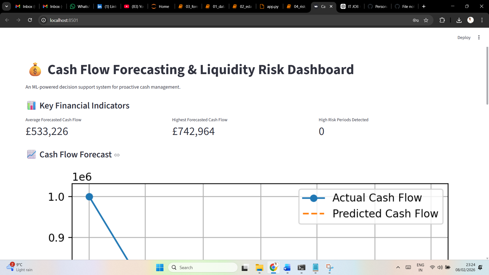
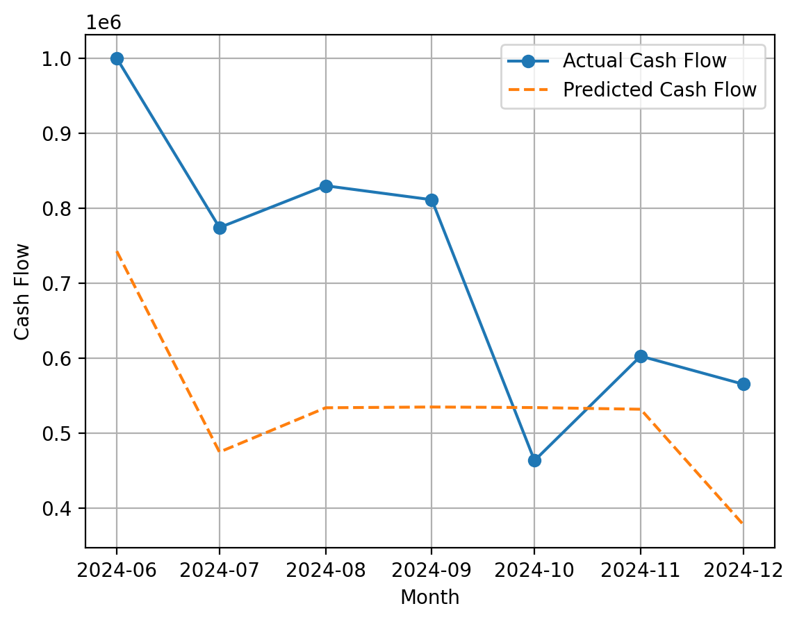

# Cash Flow Forecasting & Liquidity Risk Detection

## Overview
This project builds an end-to-end machine learning system to forecast cash flow
and detect liquidity risk for organisations. The solution supports proactive
financial decision-making through predictive analytics and interactive dashboards.

## Business Problem
Finance teams often lack early visibility into future cash shortages, relying
on manual spreadsheets and reactive reporting. This project addresses that gap
by predicting future cash flow and identifying high-risk liquidity periods.

## Solution
- Simulated ERP-style financial data
- Engineered time-series features
- Built ML models for forecasting and risk classification
- Delivered insights via a Streamlit dashboard

## Technology Stack
- Python, Pandas, NumPy
- Scikit-learn
- Streamlit
- Matplotlib

## Dashboard

## Results
- Accurate cash flow forecasting using ensemble models
- Probability-based liquidity risk alerts
- Business-friendly decision support interface

## 📊 Dashboard Preview

### Key Financial Indicators

### Cash Flow Forecast (Actual vs Predicted)

### Liquidity Risk Alerts

